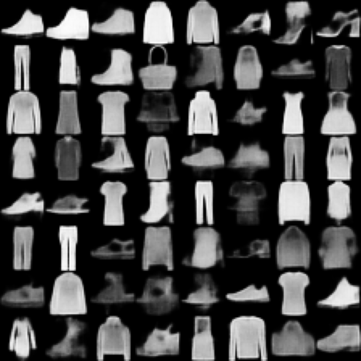
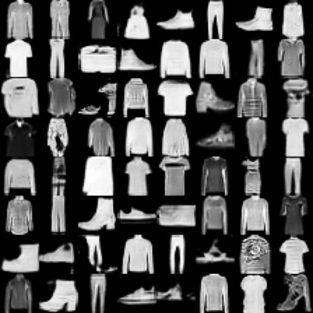

# Fashion-MNIST Generation with VAE and GAN

The goal is to generate synthetic Fashion-MNIST images and compare two generative models:

- a Variational Autoencoder (VAE);
- a Generative Adversarial Network (GAN).

The comparison considers visual quality, training behaviour, sample diversity and similarity to the training data.

## Project workflow

The project is divided into four notebooks, designed to be run in order:

| Notebook | Description |
| --- | --- |
| `1-eda.ipynb` | Dataset exploration, preprocessing and train/validation/test splits |
| `2-vae.ipynb` | VAE experiments, hyperparameter search and Conv-β-VAE training |
| `3-gan.ipynb` | GAN experiments, model selection and EMA fine-tuning |
| `4-comparison.ipynb` | Final comparison using FID, MS-SSIM and nearest-neighbour analysis |

## Generated samples

| VAE | GAN |
| --- | --- |
|  |  |

In this experiment, the VAE produced smoother samples and showed more stable training, while the GAN generated sharper images and achieved better realism according to the selected metrics.

## How to run

The notebooks were developed on Kaggle and exchange their results through Kaggle datasets.

1. Upload the notebooks to Kaggle.
2. Run `1-eda.ipynb` and save its output as a dataset.
3. Attach the EDA dataset to `2-vae.ipynb` and `3-gan.ipynb`.
4. Save the outputs of the VAE and GAN notebooks as separate datasets.
5. Attach all three datasets to `4-comparison.ipynb` and run the final evaluation.

Paths containing `YOUR_KAGGLE_USERNAME` are placeholders. Replace them with your own Kaggle username and adjust the dataset slugs if Kaggle assigns different input paths.

Kaggle provides the required libraries by default. To prepare a local environment instead, run:

```bash
pip install -r requirements.txt
```

Generated datasets, trained models and intermediate outputs are excluded from Git to keep the repository lightweight. The sample images used in this README are included in `figures/`.

## Report

The complete methodology, experiments and discussion are available in [ELE680_FinalReport.pdf](ELE680_FinalReport.pdf).

## Disclaimer

This repository was developed as a university project for the **ELE680 Deep Neural Networks** course.
